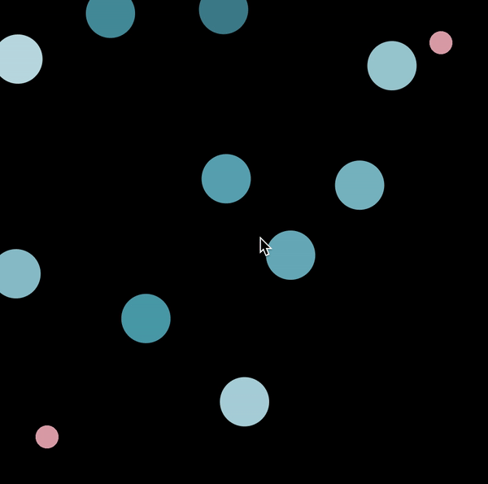

# data-viz
Coursework and projects from COMP 177: Data Visualization taken during the spring of 2020

## SVG Lab
Created an interactive graphical representation of the word **aligned** using SVG element and D3 Javascript
Click the link to play with it: https://sejaldua.com/data-viz/SVG-Lab/sdua01.html

Or check out the GIF below:

 
